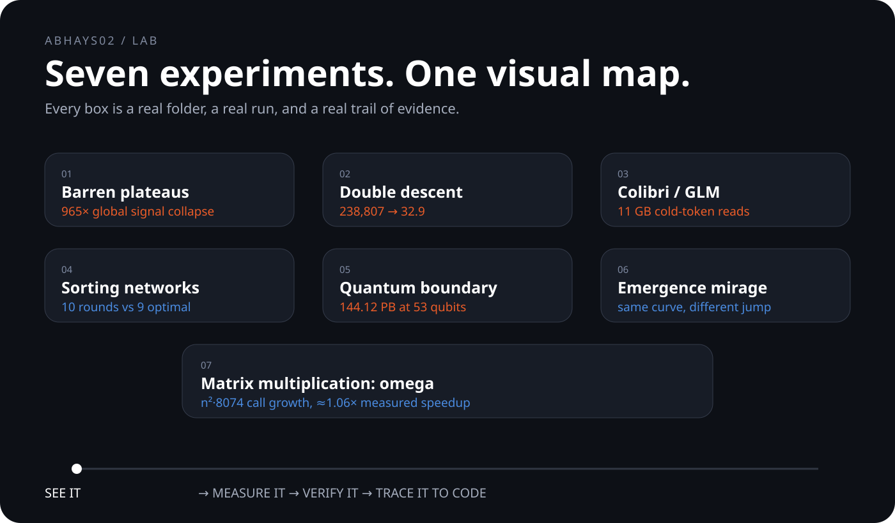

# ABHAYS02 / LAB

<p align="center">
  
</p>

<p align="center">
  
</p>

## What is in the lab

Seven small experiments. Each one has its own folder, visual explanation, code, raw output, and provenance.

| # | Experiment | What you see first | Status |
|---|---|---|---|
| 01 | [Barren plateaus](barren-plateaus/) | **965×** global gradient-variance collapse | reproduction + verified run |
| 02 | [Double descent](double-descent/) | **238,807 → 32.9** around `p = 100 → 101` | reproduction + verified run |
| 03 | [Colibri / GLM](colibri-glm/) | **11 GB** cold-token disk reads | arithmetic validation |
| 04 | [Sorting networks](sorting-network-depth/) | **10 vs 9** rounds at `n = 16` | reproduction + verification |
| 05 | [Quantum advantage boundary](quantum-advantage-boundary/) | **144.12 PB** at 53 qubits | validation + framing |
| 06 | [Emergence mirage](emergence-mirage/) | **same curve, different jump** | mechanism reproduction |
| 07 | [Matrix multiplication](matmul-omega/) | **n^2.8074** call growth | reproduction + measurement |

## Open any experiment

Every folder follows the same visual path:

```text
VISUAL
  ↓
THE QUESTION
  ↓
THE MEASUREMENT
  ↓
THE CHECK
  ↓
THE CODE + RAW DATA
```

The first screen is meant to make the idea understandable before the technical details.

## What each folder contains

- `animation.svg` — GitHub-visible visual overview
- `visual.html` — interactive version when available
- `frame.*` — poster / figure artifact when available
- `*.py` — the actual experiment
- `*.json` — raw output
- `compute.md` — sources, validation, and claim classification
- `README.md` — short human explanation

## How to read the labels

| Label | Meaning |
|---|---|
| **Established** | Known before this run. |
| **Verified here** | Independently computed in this repo. |
| **Hypothesis** | Still being tested. |
| **Not claimed** | Interesting, but not presented as a new discovery. |

## The research map

[Open the notebook](docs/RESEARCH_NOTEBOOK.md)

It gives the full experiment-by-experiment view and the provenance rules used across the lab.

## Start with the visual, then go deeper

**Barren plateaus** — [open](barren-plateaus/)

**Double descent** — [open](double-descent/)

**Colibri / GLM** — [open](colibri-glm/)

**Sorting networks** — [open](sorting-network-depth/)

**Quantum advantage boundary** — [open](quantum-advantage-boundary/)

**Emergence mirage** — [open](emergence-mirage/)

**Matrix multiplication** — [open](matmul-omega/)

## The rule

A result is not made more original by making the README sound more confident.

The lab keeps the distinction visible:

```text
KNOWN
  ↓
RUN HERE
  ↓
VERIFY
  ↓
SAY EXACTLY WHAT CHANGED
```

[abhays02/lab](https://github.com/abhays02/lab)
