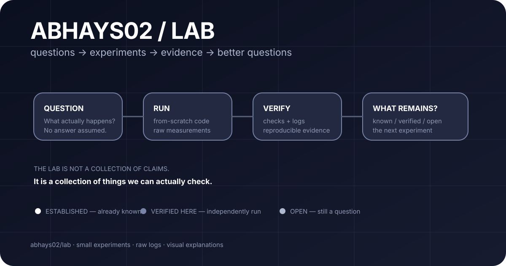

# ABHAYS02 / LAB

<p align="center">
  
</p>

> **Small experiments. Real runs. Raw evidence.**
>
> This is where I test ideas before I trust them.

## Start here

| | Experiment | The hook |
|---|---|---|
| 01 | [Barren plateaus](barren-plateaus/) | **When does a learning signal go silent?** |
| 02 | [Double descent](double-descent/) | **Why does one extra feature make the cliff disappear?** |
| 03 | [Colibri / GLM](colibri-glm/) | **How can a 744B model run from a laptop?** |
| 04 | [Sorting networks](sorting-network-depth/) | **Why is a classic network still one round too deep?** |
| 05 | [Quantum advantage boundary](quantum-advantage-boundary/) | **Where does the classical chase stop?** |
| 06 | [Emergence mirage](emergence-mirage/) | **Can the same smooth curve look like a sudden breakthrough?** |
| 07 | [Matrix multiplication](matmul-omega/) | **How far can Strassen's idea actually take us?** |

## The rule

```text
QUESTION
   ↓
RUN
   ↓
VERIFY
   ↓
SHOW THE EVIDENCE
   ↓
SAY WHAT IS STILL UNKNOWN
```

No experiment gets promoted into a discovery just because the result looks interesting.

## Every experiment has three layers

**1. SEE IT**

A visual explanation first.

**2. MEASURE IT**

A real number, curve, table, or test.

**3. REPRODUCE IT**

Code + raw output + validation notes.

## What the labels mean

| Label | Meaning |
|---|---|
| **ESTABLISHED** | Already supported by prior work. |
| **VERIFIED HERE** | Independently computed in this lab. |
| **HYPOTHESIS** | An idea that still needs testing. |
| **NOT CLAIMED** | Deliberately not presented as new. |

## The visual notebook

[Open the research notebook](docs/RESEARCH_NOTEBOOK.md)

It maps the experiments by question, visual idea, measurement, and evidence.

## A few rabbit holes

### Signal → silence

[barren-plateaus](barren-plateaus/) measures how a global cost function can lose gradient signal far faster than a local one.

### The interpolation cliff

[double-descent](double-descent/) walks through the sharp risk spike around the point where a model can exactly fit its training data.

### Same curve, different illusion

[emergence-mirage](emergence-mirage/) shows how an unchanged smooth capability curve can look dramatically more sudden when the metric demands many correct tokens at once.

### One layer too deep

[sorting-network-depth](sorting-network-depth/) builds Batcher's network from scratch and checks it against brute-force 0-1 inputs.

## Run one

Most experiments are deliberately small and dependency-light.

```bash
cd barren-plateaus
python barren.py
```

Then open the experiment's visual artifact and inspect the raw log.

## Why this exists

Not every useful experiment needs to become a paper.

Sometimes the useful outcome is simply:

```text
"I thought X.
I ran it.
X was not quite right.
Now I know why."
```

That is still research.

---

**abhays02 / lab**  
Small experiments · visual explanations · reproducible evidence
