# ABHAYS02 / LAB

<p align="center">
  
</p>

## The lab in one screen

Six experiments. Six different questions. One rule: **make the result easy to see before asking anyone to read the code.**

| # | Experiment | The question | The result |
|---|---|---|---|
| 01 | [Barren plateaus](barren-plateaus/) | Does the gradient survive as qubits increase? | **965×** global variance drop |
| 02 | [Double descent](double-descent/) | Why can one extra feature change test error so sharply? | **238,807 → 32.9** |
| 03 | [Colibri / GLM](colibri-glm/) | How much of a huge model is active per token? | **5.38% active**; ~**11 GB** cold-token reads |
| 04 | [Sorting networks](sorting-network-depth/) | Can a correct sorting network still be too deep? | **10 vs 9** rounds at `n = 16` |
| 05 | [Quantum advantage boundary](quantum-advantage-boundary/) | Why does exact simulation hit a memory wall? | **144.12 PB** at 53 qubits |
| 06 | [Emergence mirage](emergence-mirage/) | Can a metric make a smooth curve look like a jump? | **Same curve, much sharper story** |

## What happens inside a folder?

```text
           QUESTION
               ↓
        WHAT DID WE RUN?
               ↓
          WHAT CAME OUT?
               ↓
       WHY SHOULD I CARE?
               ↓
     WHAT IS ACTUALLY VERIFIED?
               ↓
       CODE + RAW EVIDENCE
```

Every experiment README answers those questions directly.

## What the visuals are for

The visual is not decoration.

It should let you understand:

```text
WHAT IS MOVING?
WHAT IS BEING COMPARED?
WHERE IS THE SURPRISE?
WHAT NUMBER PROVES IT?
```

Then the reader can choose how deep to go.

## Evidence language

| Label | Meaning |
|---|---|
| **Established** | Known before this run. |
| **Verified here** | Independently computed in this repo. |
| **Not claimed** | Not presented as a new scientific discovery. |

## One consistent evidence trail

```text
README
  ↓
VISUAL EXPLANATION
  ↓
EXPERIMENT CODE
  ↓
RAW RESULT
  ↓
PROVENANCE / SOURCES
```

## The six experiments

**Barren plateaus** — [see the signal collapse](barren-plateaus/)

**Double descent** — [see the interpolation spike](double-descent/)

**Colibri / GLM** — [see the storage bottleneck](colibri-glm/)

**Sorting networks** — [see the depth gap](sorting-network-depth/)

**Quantum advantage boundary** — [see the memory wall](quantum-advantage-boundary/)

**Emergence mirage** — [see how the metric changes the story](emergence-mirage/)

## The research map

[Open the experiment notebook](docs/RESEARCH_NOTEBOOK.md)

[abhays02/lab](https://github.com/abhays02/lab)
