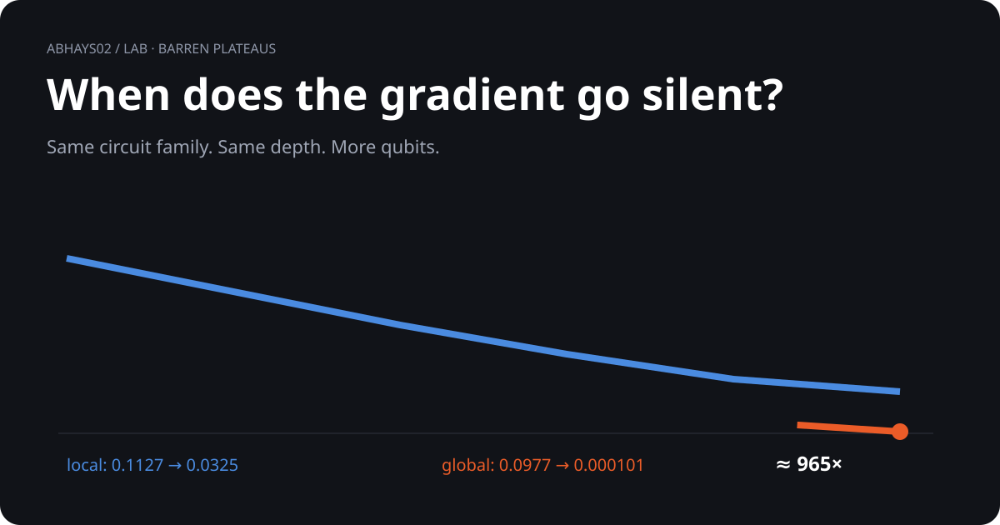

# Barren plateaus

<p align="center">
  
</p>

> **When does a learning signal go silent?**

| Measure | 2 qubits | 12 qubits |
|---|---:|---:|
| Local gradient variance | 0.1127 | 0.0325 |
| Global gradient variance | 0.0977 | 0.000101 |

## What you are seeing

- Same circuit depth: `20`
- Same parameter
- Same random-circuit family
- Only the qubit count changes
- Global readout loses signal much faster

## The run

- Pure NumPy statevector simulator
- `150` circuits per qubit count
- `2 → 12` qubits
- Exact parameter-shift gradients
- Local `<Z₀>` vs global parity `<Z₀…Zₙ₋₁>`

## Takeaway

```text
LOCAL   0.1127  →  0.0325
GLOBAL  0.0977  →  0.000101
                    ≈ 965×
```

This is a reproduction of an established barren-plateau effect. The numbers are independently computed in this repo.

## Go deeper

[Open the interactive visual](visual.html) · [Run the code](barren.py) · [Read the evidence](compute.md) · [Inspect raw data](barren_log.json)

[Back to the lab](../)
