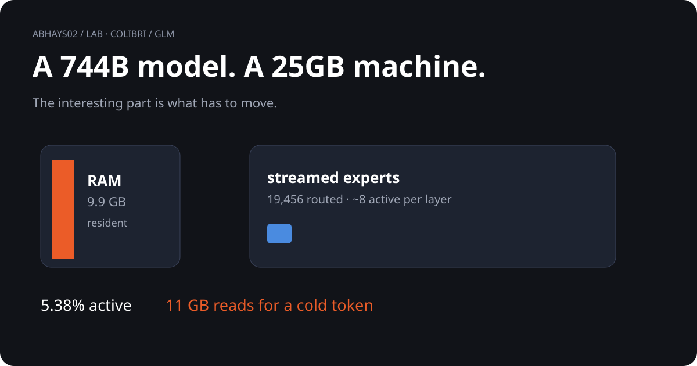

# Colibri / GLM

<p align="center">
  
</p>

## 01. The question

> **How can a model with 744B parameters operate when only a small fraction is active for each token?**

```text
744B total parameters
        │
        ▼
40B active / token
        │
        ▼
  5.38% active
        │
        ▼
experts loaded on demand
        │
        ▼
~11GB cold-token reads
```

## 02. The numbers

| Quantity | Value |
|---|---:|
| Total parameters | **744B** |
| Active per token | **40B** |
| Active fraction | **5.38%** |
| Routed experts | **19,456** |
| Implied experts / layer | **~7.9** |
| Published cold-cache speed | **0.05–0.1 tok/s** |
| Implied read throughput | **0.55–1.1 GB/s** |

## 03. What I checked

```text
published architecture
        ↓
active fraction
        ↓
experts used / layer
        ↓
bytes moved / token
        ↓
implied storage throughput
```

The arithmetic is internally consistent with the published architecture numbers.

## 04. What does the result mean?

The interesting constraint is not just parameter count.

It is **how much of the model must move through storage for each token**.

The implied read rate is about **3.2–12.7× below** common rated sequential NVMe throughput.

That is an engineering question.

It is **not** a diagnosis of the implementation.

## 05. Boundary of this experiment

| Source | What it provides |
|---|---|
| Published Colibri / GLM material | Architecture and reported performance |
| This lab | Independent arithmetic checks |
| Not done here | A benchmark of the full 372GB model |

## 06. Evidence path

```text
ARCHITECTURE
    ↓
CALCULATIONS
    ↓
colibri_math.json
    ↓
compute.md
```

[Visual explainer](frame.html) · [Calculation](colibri_math.py) · [Output](colibri_math.json) · [Evidence](compute.md)

[Back to the lab](../)
