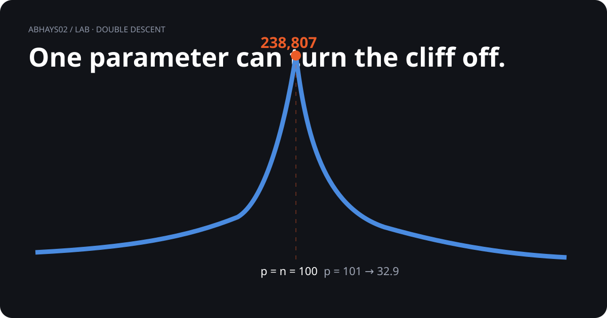

# Double descent

<p align="center">
  
</p>

## 01. The question

> **Why can adding one more feature make test error collapse?**

```text
more features
      │
      ▼
   fit gets better
      │
      ▼
 interpolation point
      │
      ├── p = 100 → huge spike
      │
      └── p = 101 → sharp drop
```

## 02. The experiment

| Part | Choice |
|---|---|
| Training points | 100 |
| Model features | Random Fourier features |
| Fit | Minimum-norm least squares |
| Trials | 30 per feature count |
| Sweep | 5 → 2,000 features |

## 03. The result

| Features | Test MSE | Visual meaning |
|---:|---:|---|
| 5 | 1.209 | ordinary regime |
| 100 | **238,807** | interpolation spike |
| 101 | **32.9** | immediate collapse |
| 2,000 | **0.464** | lower-error regime |

```text
TEST ERROR
   │             /\
   │            /  \
   │___________/    \____________
               100  101          features
```

## 04. What this answers

**The interpolation threshold can produce a very large test-error spike, followed by a second descent.**

One extra feature moves the experiment from the peak into the descending side.

## 05. What is actually ours?

| Layer | Answer |
|---|---|
| Established | Double descent is established in prior work. |
| Verified here | This exact sweep and these measured values. |
| Not claimed | A new theory of double descent. |

## 06. Why the visual matters

The table gives the numbers.

The curve gives the shape.

The code gives the reproducibility.

```text
NUMBERS → SHAPE → MECHANISM → REPRODUCTION
```

## 07. Evidence path

[Animated visual](visual.html) · [Code](double_descent.py) · [Raw log](double_descent_log.json) · [Evidence](compute.md)

[Back to the lab](../)
