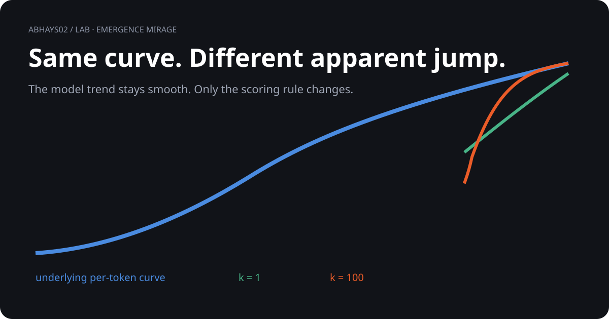

# Emergence mirage

<p align="center">
  
</p>

> **Same underlying curve. Different apparent story.**

| Steps required | Per-token accuracy for 50% exact match | Crossing |
|---:|---:|---:|
| 1 | 50.00% | x = 5.00 |
| 5 | 87.06% | x = 6.59 |
| 20 | 96.59% | x = 7.79 |
| 50 | 98.62% | x = 8.56 |
| 100 | 99.31% | x = 9.14 |

## What you are seeing

```text
ONE SMOOTH MODEL CURVE
          │
          ├── k = 1    → gradual
          ├── k = 20   → sharper
          └── k = 100  → looks like a jump
```

The underlying curve never changes.

## The run

- One deterministic logistic per-token curve
- No model training
- No external data
- Exact arithmetic
- `k = 1, 5, 20, 50, 100`

## Takeaway

The metric-artifact mechanism is established in prior work. This run independently reproduces and quantifies it.

It does **not** establish that every real emergent ability is a metric artifact.

## Go deeper

[Open the original visual](visual.svg) · [Run the experiment](emergence_mirage.py) · [Read the evidence](compute.md) · [Inspect output](emergence_results.json)

[Back to the lab](../)
