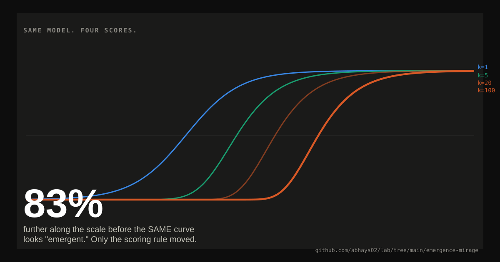

# Emergence mirage

<p align="center">
  
</p>

> **Same underlying curve. Different story.**

The experiment keeps the model trend fixed.

Only the scoring rule changes.

| Steps required | Per-token accuracy for 50% exact match | Apparent crossing |
|---:|---:|---:|
| 1 | 50.00% | x = 5.00 |
| 5 | 87.06% | x = 6.59 |
| 20 | 96.59% | x = 7.79 |
| 50 | 98.62% | x = 8.56 |
| 100 | 99.31% | x = 9.14 |

### The trick

```text
ONE SMOOTH MODEL CURVE
          │
          ├── score one step  → gradual
          │
          ├── score 20 steps  → sharper
          │
          └── score 100 steps → looks like a jump
```

The underlying curve never changes.

### What I ran

- One deterministic logistic per-token accuracy curve
- No model training
- No external data
- Exact arithmetic
- `k = 1, 5, 20, 50, 100`

### What this proves

- A nonlinear metric can create a strong appearance of emergence.
- The exact-match artifact is established in prior work.
- This run independently reproduces the mechanism and quantifies it.

### What it does not prove

It does not show that every real-world emergent ability is a metric artifact.

That question remains open.

### Reproduce

```bash
python emergence_mirage.py
```

Then inspect:

- `visual.svg` — visual explanation
- `emergence_results.json` — exact outputs
- `compute.md` — provenance

[Back to the lab](../)
