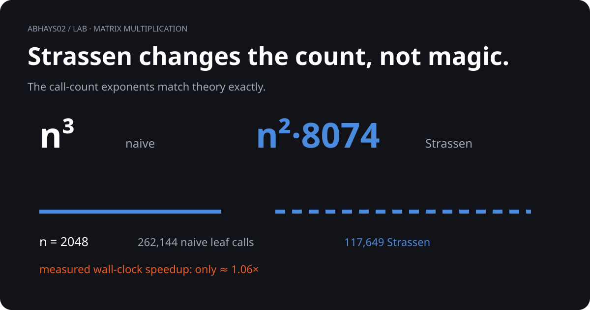

# Matrix multiplication: omega

<p align="center">
  
</p>

> **Strassen changes the exponent. The clock is a different story.**

| n | Naive leaf calls | Strassen leaf calls | Measured speedup |
|---:|---:|---:|---:|
| 64 | 8 | 7 | 0.89x |
| 256 | 512 | 343 | 0.53x |
| 1,024 | 32,768 | 16,807 | 0.79x |
| 2,048 | 262,144 | 117,649 | **1.06x** |

## What you are seeing

```text
naive      8^k  →  n³.0000
Strassen   7^k  →  n².8074
```

Both implementations use the same recursive structure and the same NumPy leaf multiplication.

## What I verified

- Correct against NumPy at `n = 64, 128, 256`
- Empirical naive exponent: `3.0000`
- Empirical Strassen exponent: `2.8074`
- Measured 2,048 × 2,048 speedup: `1.06x`

The last number matters: asymptotic improvement does not automatically become a dramatic wall-clock win in a small Python implementation.

## Takeaway

This experiment demonstrates the established exponent gap and measures what that gap looks like in a real implementation.

## Go deeper

[Open the poster](frame.png) · [Run the code](strassen.py) · [Read the evidence](compute.md) · [Inspect raw data](matmul_log.json)

[Back to the lab](../)
