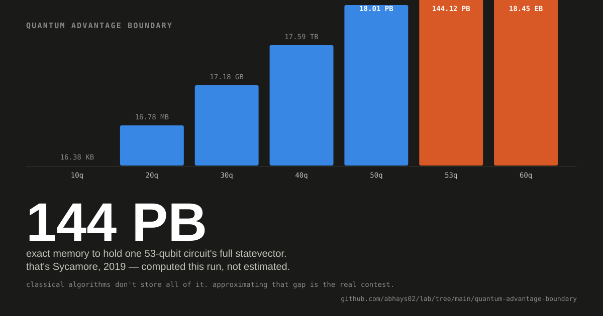

# Quantum advantage boundary

<p align="center">
  
</p>

> **At 53 qubits, the full statevector needs 144.12 PB.**

That is only the storage problem.

The real question is what classical algorithms can do without storing it all.

### What I verified

| Check | Result |
|---|---:|
| Circuit size | 14 qubits |
| Deep-run samples | 98,304 |
| Porter–Thomas variance at 40 layers | 1.0167 |
| Target variance | 1.0000 |
| KS statistic at 40 layers | 0.00264 |
| Linear XEB | 1.012 ± 0.015 |
| Exact statevector memory at 53 qubits | 144.12 PB |

### Depth changes the distribution

```text
layers     9       15       20       30       40
KS       .123     .067     .024     .009     .0026
          └──────────────→ closer to Porter–Thomas
```

### What I ran

- From-scratch NumPy statevector simulator
- 14 qubits
- Haar-random single-qubit SU(2) gates
- Brick-pattern CZ entanglers
- Depth sweep: 9 → 60
- Six independent circuits per depth
- Exact memory arithmetic for full statevectors

### What this is

- A validation experiment.
- A visual way to understand why RCS gets difficult to simulate.
- Not a new quantum-advantage claim.

### The open question

Does the classical boundary eventually stop moving, or does every new quantum advantage claim become another moving target for classical simulation?

This run does not answer that.

### Reproduce

```bash
python rcs_verify.py
```

Then inspect:

- `visual.svg` — the 144 PB story
- `rcs_results.json` — raw measurements
- `compute.md` — provenance and literature

[Back to the lab](../)
