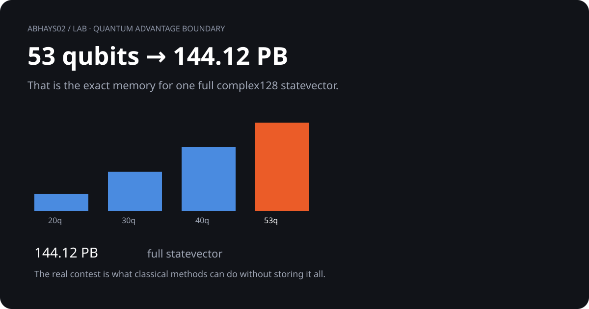

# Quantum advantage boundary

<p align="center">
  
</p>

## 01. The question

> **Why does exact classical simulation become difficult so quickly as qubit count grows?**

```text
1 qubit  →      2 amplitudes
10 qubits →   1,024
30 qubits →   1.07 billion
53 qubits →   2^53 amplitudes
```

The storage requirement grows as `2^n`.

## 02. The memory wall

| Qubits | Exact complex128 statevector |
|---:|---:|
| 10 | 16.38 KB |
| 20 | 16.78 MB |
| 30 | 17.18 GB |
| 40 | 17.59 TB |
| 50 | 18.01 PB |
| 53 | **144.12 PB** |
| 60 | **18.45 EB** |

```text
KB → MB → GB → TB → PB → EB
             ↑
          53 qubits
          144.12 PB
```

## 03. What else did I run?

A from-scratch 14-qubit random-circuit-sampling simulation:

| Check | Result |
|---|---:|
| Deep-run samples | 98,304 |
| Depth | 40 layers |
| Variance | 1.0167 vs 1.0000 target |
| KS statistic | **0.00264** |
| Linear XEB | **1.012 ± 0.015** |

## 04. What changes with depth?

```text
9 layers   KS 0.1225
15 layers  KS 0.0666
20 layers  KS 0.0236
30 layers  KS 0.0091
40 layers  KS 0.0026
```

Lower KS here means the sampled distribution is getting closer to the Porter–Thomas reference.

## 05. What this experiment answers

**Exact state storage becomes enormous very quickly, while the circuit statistics can approach the expected RCS regime at modest depth.**

## 06. What this does not claim

| Statement | Status |
|---|---|
| Full-state memory grows exponentially | Verified by exact arithmetic |
| This 14-qubit run reaches the expected distributional regime | Verified here |
| A new quantum-advantage claim | **Not claimed** |

The experiment explains the simulation boundary. It does not prove where the ultimate quantum/classical boundary lies.

## 07. Evidence path

[Visual](visual.svg) · [Verifier](rcs_verify.py) · [Raw results](rcs_results.json) · [Evidence](compute.md)

[Back to the lab](../)
