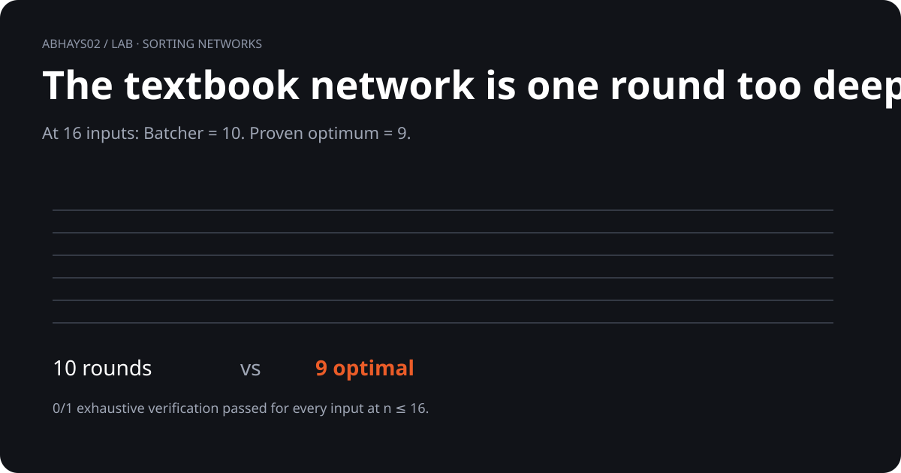

# Sorting network depth

<p align="center">
  
</p>

> **The textbook network works. It is just one round too deep at 16 inputs.**

| n | Batcher depth | Known optimum / best known |
|---:|---:|---:|
| 16 | **10** | **9** proven optimal |
| 17 | 10 | 10 proven optimal |
| 28 | 13 | best known, not proven optimal |

## What I checked

```text
Batcher
  ↓
comparators
  ↓
parallel layers
  ↓
0 / 1 exhaustive verification
```

- Batcher network built from scratch
- Comparator count and depth cross-checked
- Every binary input checked for `n ≤ 16`
- Zero counterexamples

## Takeaway

At `n = 16`, the classic construction leaves **one avoidable round**.

The construction itself is established. The verification in this repo is independent.

## Go deeper

[Open the animated visual](visual.html) · [Run the code](batcher_verify.py) · [Read the evidence](compute.md) · [Inspect results](batcher_results.json)

[Back to the lab](../)
